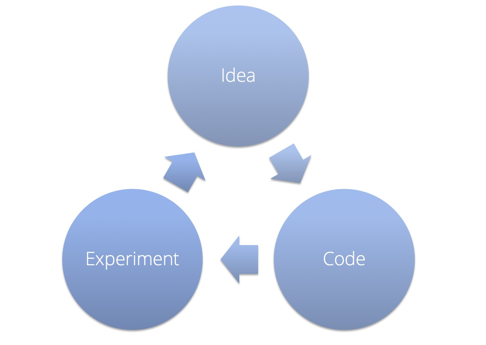

## Train, Dev(validation) & Test set

> **Training set**: Which you run your learning algorithm on.
>
> **Dev(validation) set**: Which you use to tune parameters, select features, and make other decisions regarding the learning algorithm. 
>
> **Test set​:** Which you use to evaluate the performance of the algorithm, but not to make any decisions regarding what learning algorithm or parameters to use.

### Dev set & Test set

- Don't assume the training distribution is the same the your test distribution. Try to choose dev and test sets that reflect what you **ultimately want to perform well on**, rather than whatever data you happen to have for training.
- Dev and test set should have the **same distribution**.
- The dev set should be **large enough to detect differences between algorithms that you are trying out**. For mature and important applications, for example, advertising, web search, and product recommendations, dev set size could be large enough in order to detect even smaller improvements.
- Test set size should be large enough to **give high confidence in the overall performance of your system**.
- There is no need to have excessively large dev/test sets beyond what is needed to evaluate the performance of your algorithms.

### Evaluation metric

- Having a ​**single-number evaluation metric​** such as accuracy allows you to sort all your models according to their performance on this metric, and quickly decide what is working best.
-  If there are multiple goals be cared about, consider combining them into a single formula or defining satisficing and optimising metrics. (Set **some thresholds** for the other requirements like running time, model size. Then try to **optimise the metric given those constraints**.)

### Dev/test set and Metric

- Having a dev set and metric allows you to very quickly detect which ideas are successfully giving you small (or large) improvements, and therefore lets you quickly decide what ideas to keep refining, and which ones to discard. It can speed up the machine learning system building iterations.
- It is quite common to change dev/test sets or evaluation metrics during a project. Having an initial dev/test set and metric quickly helps you **iterate quickly**.
- If you ever find that the dev/test sets or metric are no longer pointing your team in the right direction, it’s not a big deal! Just change them and make sure your team knows about the new direction. The following points might be a sign that the dev/test set or metric need to be changed.
  - **The actual distribution you need to do well on is different from the dev/test sets, get new dev/test sets**.
  - **You have overfit to the dev set, get more dev set data**. The process of repeatedly evaluating ideas on the dev set causes your algorithm to gradually “overfit” to the dev set. If dev set performance is much better than test set performance, it is a sign that you have overfit to the dev set.
  - **The metric is measuring something other than what the project needs to optimise, change the metric**.

## Basic Error Analysis
When you start a new project, especially if it is in an area in which you are not an expert, it is hard to correctly guess the most promising directions. So don’t start off trying to design and build the perfect system. Instead build and train a basic system as quickly as possible. Then use error analysis to help you identify the most promising directions and iteratively improve your algorithm from there.
> **Error Analysis**: The process of examining dev set examples that your algorithm misclassified, so that you can understand the underlying causes of the errors. This can help you prioritise projects

Error analysis does not produce a rigid mathematical formula that tells you what the highest priority task should be. You also have to take into account how much progress you expect to make on different categories and the amount of work needed to tackle each one.

### Best Practices for Carrying Out Error Analysis
- Evaluating multiple ideas in parallel. Create a spreadsheet with error categories. And come up with a few ideas.
- Cleaning up mislabeled dev and test set examples by human.
  - It is not uncommon to start off tolerating some mislabeled dev/test set examples, only later to change your mind as your system improves so that the fraction of mislabeled examples grows relative to the total set of errors.
  - Whatever process you apply to fixing dev set labels, remember to do the same for the test set labels to keep dev and test sets has the same distribution.
  - **NOTE:** If you decide to improve the label quality, consider double-checking both the labels of examples that your system misclassified as well as labels of examples it correctly classified. It is possible that both the original label and your learning algorithm were wrong on an example. If you fix only the labels of examples that your system had misclassified, you might introduce bias into your evaluation. But because it is easier in practice to check only the misclassified examples, bias does creep into some dev sets. In most case, the bias is acceptable if you are interested only in developing a product or application.
- Split a large dev set into **Eyeball dev set** and **Blackbox dev set** to know when the dev set is overfitted by manual error analysis.
  - Eyeball dev set: Look into it to do error analysis. It should be large enough to give you a sense of your algorithm's major error categories. But it should also be determined by how many examples  you have time to analyse manually.
  - Blackbox dev set: Evaluate trained model, select algorithm, tune hyper-parameters. It should have enough data to **tune hyper-parameters and select among models**.
  - Use a small dev set as an Eyeball dev set entirely, but keep in mind that the risk of overfitting is greater.
  - Since you will gain intuition about Eyeball dev set example, Eyeball dev set will be overfitted faster
    - Eyeball dev set is overfitted: If the performance on the Eyeball dev set improving much more rapidly than performance on Blackbox dev set. In this case, 
      - Find a new Eyeball dev set by by moving more examples from the Blackbox dev set in the Eyeball dev set, or
      - Acquiring new labeled data 
  - Examining an Eyeball dev set **won't be helpful for a task that even humans can't do well**, since it's harder to figure out why the algorithm didn't predict correctly.